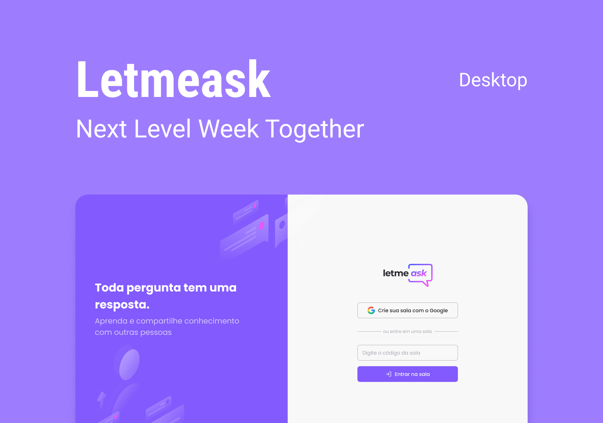

# LetMeAsk
> Every question has a answer. Written in Next.js with Firebase and styled-components


[](https://github.com/styled-components/styled-components)


# 🛠 Technologies used

- Next.js
- Firebase
- Typescript
- styled-components
- Jest
- Husky

# 🎉 Contributing

[Check this step by step](CONTRIBUTING.md)

# 🏃 Getting Started

Add this initial template using this following command:

```npx create-next-app -e git@github.com:r3nanp/letmeask.git```

Run the following command in order to start the application in a development environment:

```yarn dev```

# Layout


[Check the layout](https://www.figma.com/file/T9spsQxlFG0iO6EdcRAW4G/Letmeask-(Copy)?node-id=45%3A29835)

# :closed_book: License

Released in 2021.
This project is under the [MIT license](LICENSE).

Made with love by [Renan Pereira](https://github.com/r3nanp) 💜🚀
